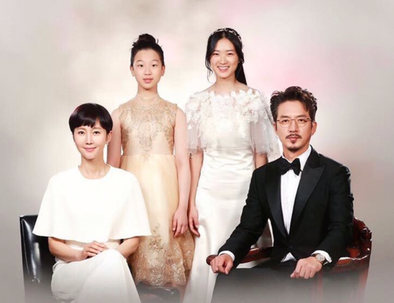
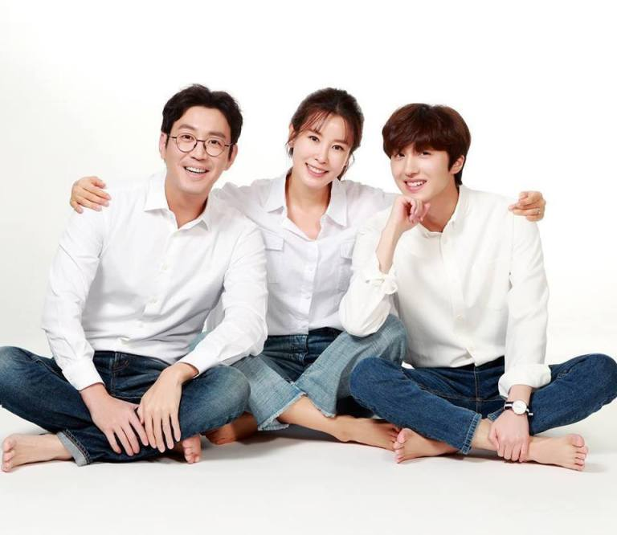
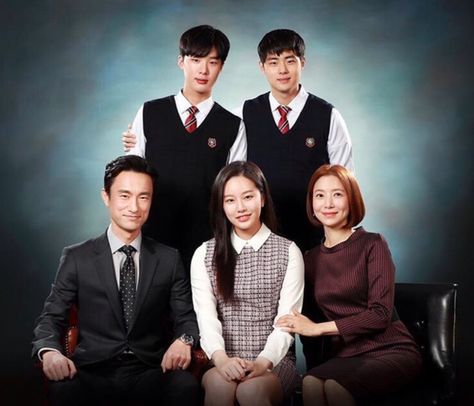
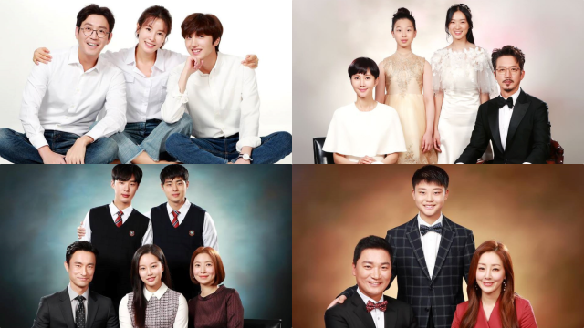

## Plot Synopsis

> "SKY Castle" follows the lives of 4 women living in luxurious SKY Castle neighborhood. They try make their husbands more successful and raise their children like prince and princesses.

> - Han Seo-Jin (Yum Jung-Ah) is married to orthopedic surgeon Kang Joon-Sang (Jung Joon-Ho). They have two daughters. Han Seo-Jin seems to have a perfect life, but she has a secret.

> - Lee Soo-Im (Lee Tae-Ran) is a writer of children's books. She holds a deep affection and consideration for people. Lee Soo-Im is married to neurosurgeon Hwang Chi-Young (Choi Won-Young). They have a son.

> - No Seung-Hye (Yoon Se-Ah) is married to law school professor Cha Min-Hyuk (Kim Byung-Chul). Her husband talks about justice and happiness, but he hides a different side. One with having extreme egoism. They have two sons.

> - Jin Jin-Hee (Oh Na-Ra) comes from a wealthy family. Her father owns buildings. Jin Jin-Hee admires Han Seo-Jin and tries to copy what she does. Like Han Seo-Jin, Jin Jin-Hee is married to an orthopedic surgeon, Woo Yang-Woo (Jo Jae-Yun).

## Cast and characters

- **Yum Jung-ah** as Han Seo-jin/Kwak Mi-hyang

  An overzealous mother who wants nothing more than her daughter to get into Seoul National Medical University. She hides her past from everyone except her husband and in-laws who knew that she grew up poor with an alcoholic father who sold oxblood and offal. She is the mother of Kang Ye-seo and Kang Ye-bin, the wife of Kang Joon-sang and daughter-in-law of Madame Yoon.

- **Lee Tae-ran** as Lee Soo-im

  A new member of the neighborhood who disapproves of the other parents' methods for getting their kids to university, believing it is too harsh. She is disliked by the other parents for disrupting the status quo. She knows who Seo-jin really is, as she knew her from when they were younger. She is the most down to earth out of all mothers in the complex and the only mother who is a step-mother. She is the stepmother of Hwang Woo-joo, and the wife of Hwang Chi-young.

- **Yoon Se-ah** as No Seung-hye

  A woman who befriends Soo-im, and starts to look down on how the other moms treat everyone and their kids. She changes her ways and becomes protective of her sons from their father's harsh teaching methods. She is the mother of Cha Se-ri, Cha Seo-joon, and Cha Ki-joon. She is the wife of Cha Min-hyuk

- **Oh Na-ra** as Jin Jin-hee

  A friend of Seo-jin who tries to get her child to do everything with Seo-jin's daughter so he can be successful. She bribes Seo-jin with gifts into trusting her with information. But she finds it difficult to keep secrets. Her loyalty changes easily as well depending on who she is with. She is the mother of Woo Soo-han, and the wife of Woo Yang-woo.

- **Kim Seo-hyung** as Kim Joo-young

  She is a well-known tutor only accessible to the elite and only caters to two students at a time. Because of her 100% success rate in getting students accepted, Seo-jin was determined to hire her as her daughter's tutor. She tutored Young-jae and Ye-seo. She hides a past that she tries to escape from. She has a daughter, Kay or Katherine, who was an acclaimed genius when they lived in Fairfax.

> ### Kang family

- **Jung Joon-ho** as Kang Joon-sang

  Seo-jin's husband. Doctor of the Joo-nam University Hospital. He holds Min-hyuk in absolute contempt and delights in the latter's misfortunes. He is very ambitious and is obsessed with maintaining a good track record to elevate his status in the hospital. He will stop at nothing in order to get rivals out of the way.

- **Kim Hye-yoon** as Kang Ye-seo

  Seo-jin's elder daughter. Her dream is to enter Seoul National University's medical faculty and be a third generation doctor. She is very impulsive and is as determined as father in achieving her goals. She has feelings for Woo-joo.

- **Lee Ji-won** as Kang Ye-bin

  Seo-jin's younger daughter. She is cynical and often clashes with her sister and believes her parents only care for her sister. She, however, gets along well with the other children in the complex and is the first one in the family to warm up to Hye-na.

- **Jung Ae-ri** as Madame Yoon
  
  Seo-jin's mother-in-law. She is the one who pushed Seo-jin to bring Ye-seo to the top in order to have a third generation doctor in the family.

 

> ### Hwang family

- **Choi Won-young** as Hwang Chi-young

  Soo-im's husband. Doctor of the Joo-nam University Hospital. Rival of Joon-sang. He grew up at an orphanage that was owned by Soo-im's parents. He was married to Woo-joo's real mother, but after she passed away, he remarried with Soo-im.

- **Kang Chan-hee** as Hwang Woo-joo

  Soo-im's step-son who is treated like her own son. He likes Hye-na, and is liked by Ye-seo. A kind student who always helps other students that have difficulties.

 

> ### Cha family

- **Kim Byung-chul** as Cha Min-hyuk
  
  Seung-hye's husband. A law school lecturer and former prosecutor. He is strict with his children and holds very high expectations of them, especially academically.

- **Park Yoo-na** as Cha Se-ri

  Seung-hye's daughter. She is the MD of a nightclub. She lied about being a Harvard University student and got caught.

- **Kim Dong-hee** as Cha Seo-joon

  Seung-hye's elder son; twin of Ki-joon. Classmate of Woo-joo. Even though he is calmer than his younger twin, he strongly dislikes his father's method of teaching and studying.

- **Jo Byung-gyu** as Cha Ki-joon

  Seung-hye's younger son; twin of Seo-joon. He likes to play tricks on Ye-seo. He strongly dislikes his father's method of teaching and studying.

 

> ### Woo family

- **Jo Jae-yoon** as Woo Yang-woo

  Jin-hee's husband. An Orthopaedics surgeon. He is very obedient to Kang Joon-sang but behind him, he admires Hwang Chi-young.

- **Lee Eugene** as Woo Soo-han

  Jin-hee's son. He is not interested in studying, but still tries his best under huge academic pressure. Soo-han has a crush on Ye-bin.

 

<!-- 
# Heading 1

## Heading 2

### Heading 3

#### Heading 4

##### Heading 5

###### Heading 6

## Normal Text

Lorem markdownum artesque tu quidem lanigeris! Amari aliquis Ismarios,
hospitiique nullum ab enim Pagasaea probabant armis iniuria inponi. Primus
Aonius graves at inductas nec motu, qui pinetis. Anxius nec ibimus utque illa
circa video est fuit labores alas. Huic per quantum undis, Themis et quamvis
gramine missisque leonibus.

## Blockquotes

> Meo locum plurimus laudatos exstantibus fistula nocte Ancaeo denique montanum.
> Dissipat nullique tenax; aut una lacessit purpureus sumptis inlaesos,
> Polypemonis quisque blanditus. Obscenas rumpitque numerum effluxere,
> pronusque: Mygdonidesque precantia erat potes undis. Resurgere conplet velut
> freta miram enim, maiorque nec nec inaniter mensura et ipse artus flebam
> gentisque solus.

## Ordered List

1. Quotiens urbis Charaxi referre
2. Terris acti iussit extrema
3. Vel totis Iove locum forma
4. Esse neve illi crimen ripis et crimina

## Unordered List

- Quotiens urbis Charaxi referre
  - freta miram enim
  - freta miram enim
    - maiorque nec nec
    - maiorque nec nec
    - maiorque nec nec
- Terris acti iussit extrema
- Vel totis Iove locum forma
- Esse neve illi crimen ripis et crimina

## Table

| Tables   |      Are      |  Cool |
|----------|:-------------:|------:|
| col 1 is |  left-aligned | $1600 |
| col 2 is |    centered   |   $12 |
| col 3 is | right-aligned |    $1 |

## Codeblock

Here a sample text which contains `<?php echo 'inline code'; ?>` and also code blocks.

```js
function visitor(node) {

  try {
    const alignment = node.align;

    visit(node, 'tableRow', (rowNode) => {
      rowNode.children.forEach(function (cellNode, index) {
        cellNode.align = alignment[index]
      });
    });

    node.align = node.align.map(function(value) {
      return null;
    });
    
  } catch (e) {
  }
}
```

## Images

 -->