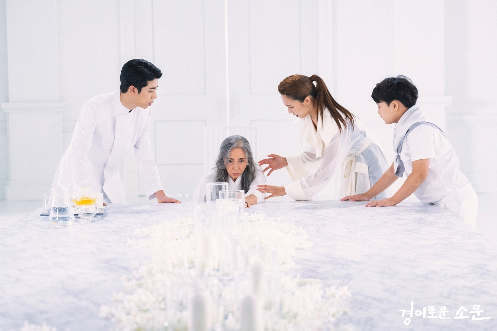

## Plot Synopsis

> In the fictional city of Jungjin, a group of four demon-hunters called the Counters bear the arduous task of searching for and banishing evil spirits (akgwi) that escape from the afterlife to gain immortality. These evil spirits possess local human hosts who have committed murder or have a strong desire to murder, encourage their host's desire to kill, and consumes the spirit of the victim. The Counters were once under coma when a partner spirit from Yung, the boundary between the afterlife and the world of the living, possess them and give them perfectly healthy bodies and consciousness along with superhuman strength and supernatural abilities. Three of the Counters—Ga Mo-tak (Yoo Jun-sang), Do Ha-na (Kim Se-jeong) and Choo Mae-ok (Yeom Hye-ran)—pose as workers in Eonni's Noodles, a noodle restaurant which serves as their hideout.

## Cast and characters

- **Joe Byeong-Gyu** as So Mun

    A high school student and he is the youngest member of "Counter". He possesses superhuman speed, short-range psychometry and the ability to sense evil spirits that enter Yung's "Territory" (but in a range minor to that of Ha-na's). As a child, he was involved in a suspicious car accident. His parents died in the accident and he was left with a limp in his left leg.

- **Yu Jun-Sang** as Ga Mo-Tak

    A former police officer. He had an accident 7 years ago, which caused him to lose his memory. he joined the Counters after being possessed by Gi-ran, granting him superhuman strength and short-range psychometry.

- **Kim Se-Jeong** as Do Ha-Na

    The server at Eonni's Noodles. The sole survivor after she and her family were poisoned, Ha-na joined the Counters after being possessed by Woo-sik who granted her superhuman strength and psychometry. She is capable of sensing evil spirits even from hundreds of kilometers away, as well as being able to read and enter memories from years ago as if she was physically there.

- **Yum Hye-Ran** as Chu Mae-Ok

    The chef of the noodle restaurant. She is the anchor of "Counter". In the past she ran a photography studio for a living. Now a grieving mother dealing with the death of her son Su-ho. She joins the Counters after being possessed by Su-ho's spirit. She gains powerful healing abilities.

- **Ahn Suk-Hwan** as Choi Jang-Mool

    The first "Counter” of Korea. He is in charge of managing expenses for the group. Jang-mul is one of the richest chaebol in South Korea. He manages the Counters' expenses and supports them in matters that need his influence. He retired from being a Counter, though his powers and responsibilities as a Counter remain.

> ### Yung

- **Moon Sook** as Wi-gen

    Mun's first Yung partner. Wi-gen is the leader of the Yung, the boundary between the afterlife and the world of the living. She is amazed by the fact that she was able to possess Mun despite the latter not being comatose.

- **Kim So-ra** as Kim Gi-ran
    Mo-tak's Yung partner. Gi-ran is an upright spirit who is greatly angered by Mo-tak and his fellow Counters' occasional rule-breaking.

- **Eun Ye-jun** as Woo-sik

    Ha-na's Yung partner. Woo-sik appears to be a young boy but he is mature in his mindset and personality.

- **Lee Chan-hyung** as Kwon Su-ho

    Mae-ok's Yung partner and her biological son. Su-ho is in charge of keeping Yung's record of deaths.

- **Woo Mi-hwa** as The Prosecutor

 