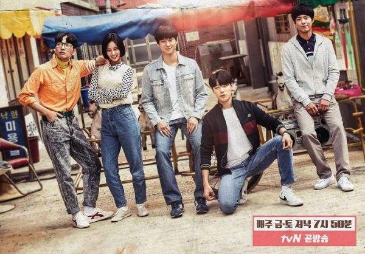
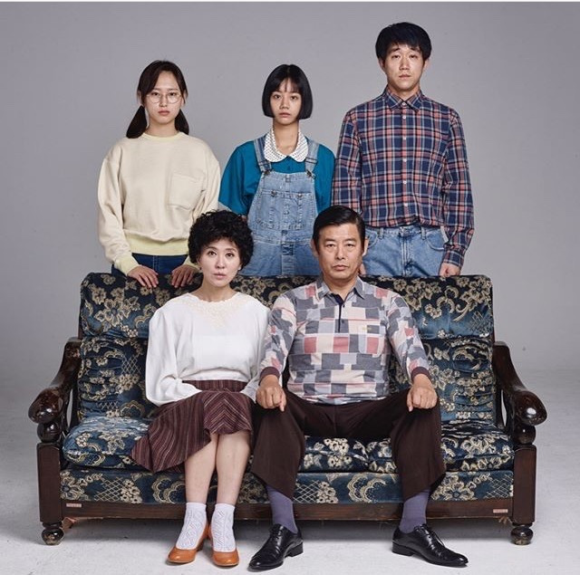
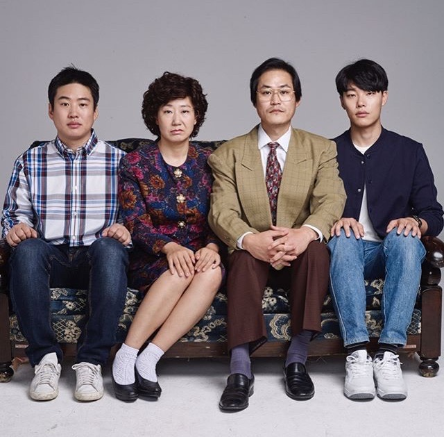
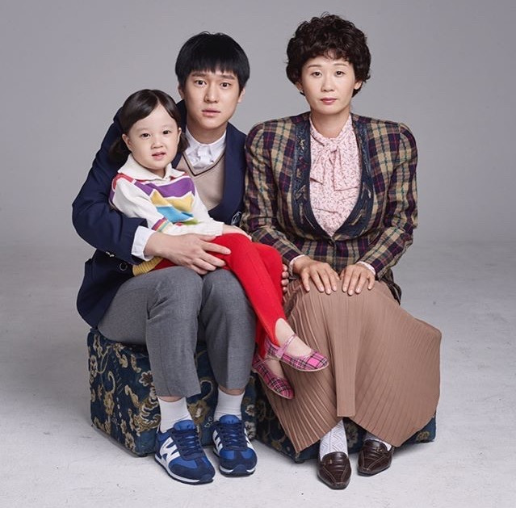
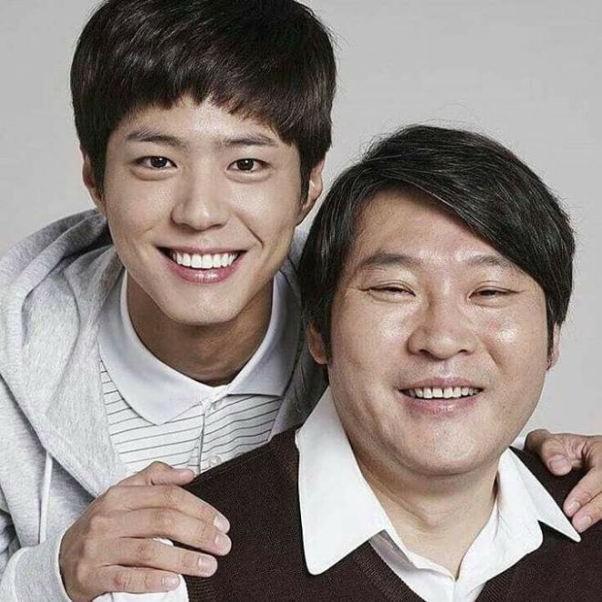
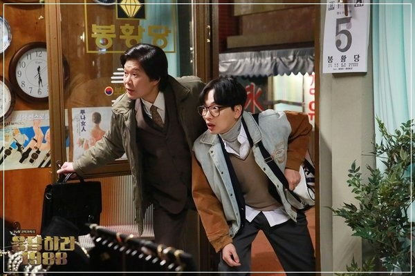

## Plot Synopsis

> In 1988, Duk-Sun (Hyeri), Jung-Hwan (Ryoo Joon-Yeol), Sun-Woo (Ko Gyung-Pyo) and Dong-Ryong (Lee Dong-Hwi) are high school students and Taek (Park Bo-Gum) is a go player. These five people have been friends since they were little kids. They all grew up together and are neighbors to this day. Their families are also very close to each other. They always hang around Taek's room and spend time together.

> - Duk-Sun’s family is poor and they live in a semi-basement house. Duk-Sun's father Dong-Il (Sung Dong-Il) lost money due to guaranteeing someone else's debt. Nevertheless, Duk-Sun has a bright personality and enjoys singing and dancing. She always gets into fights with her older sister Bo-Ra (Ryoo Hye-Young).

> - Jung-Hwan’s family became rich overnight. Jung-Hwan is crazy about soccer.

> - Sun-Woo is a model student at school, good son and good brother at home. Sun-Woo’s mother has raised Sun-Woo and his younger sister alone after Sun-Woo’s father passed away.

> - Dong-Ryong likes dancing and hanging out with his 4 friends. He gives up going to a university due to his poor academic score.

> - Taek is a famous go player known as God. Since he dropped out of school, Duk-Sun, Jung-Hwan, Sun-Woo and Dong-Ryong are his only friends.

## Cast and characters

- **Lee Hye-ri** as Sung Duk-seon/Sung Soo-yeon

    The middle child of her family, she is infamously ranked 999th in school and is the only girl in their group of five neighborhood friends. Duk-seon has a bright and compassionate personality. She cares deeply for her friends and classmates, but feels lost without a "dream" to pursue. Duk-seon moves through the stages of her youth alongside her male friends, and the mystery of which of them she eventually marries is a continual point of tension for viewers throughout the series.

- **Park Bo-gum** as Choi Taek

    An internationally renowned genius Baduk player, Taek is the quietest of his neighborhood friends. Taek dominates on the Baduk board but struggles with simple every-day tasks. His Baduk success has brought money and fame but has left Taek distant from his age group, and so he relies on his neighborhood friends for companionship, grounding, and a connection to youth. Taek is generous to a fault and hesitant to make a fuss, but that hesitancy disappears in competition. However, when he realizes that the person he cares for has another admirer, he has to weigh romance against friendship.

- **Go Kyung-pyo** as Sung Sun-woo

    A class president, caring brother, and dependable son to his widowed mother, Sun-woo is an ideal young man. He is devoted to his friends and dotes on his younger sister. Sun-woo harbors a secret crush on a neighborhood friend that lingers into adulthood.

- **Ryu Jun-yeol** as Kim Jung-hwan

    Stoic and sarcastic, but with a secretly sweet heart, Jung-hwan (called Jung-pal by his friends) is one of the leaders of the neighborhood group. Jung-hwan is handsome, smart, and athletic, often taking on extra feelings of responsibility to fulfill the dreams of his older brother Jung-bong, who has a chronic heart condition. While Jung-hwan doesn't often share his emotions with others, he feels things deeply and uses his sarcasm and attitude as a shield. He develops feelings for a neighborhood friend early, but is reluctant to admit his crush, even as the right timing slips away.

- **Lee Dong-hwi** as Ryu Dong-ryong

    The neighborhood clown, Dong-ryong loves to sing, dance, and play jokes on his friends. Like Duk-seon, Dong-ryong is not a natural academic, but his thoughtful insight and surprising wisdom serve him and his friends well. As the son of two working parents surrounded by tight-knit families, Dong-ryong sometimes feels neglected by his parents and makes up for their absence by acting out. His nosy nature means that he ends up knowing many of the neighborhood's secrets before anyone else.

 

> ### Sung family

- **Sung Dong-il** as Sung Dong-il (Duk-seon's father)

     A fraud and security specialist at a bank, Dong-il fell into debt after lending money to a friend who never paid it back. He struggles to provide for his family as he wants to while paying off the debt, but does his best to give everything he can to his children. He and his wife, Il-hwa, argue but love each other very deeply.

- **Lee Il-hwa** as Lee Il-hwa (Duk-seon's mother)

    Il-hwa is a kind woman who spends much of her time with the other moms and caring for her family. She worries about her children and husband and shows much of her care by cooking massive quantities of food to share with her family and the neighborhood.

- **Ryu Hye-young** as Sung Bo-ra (Duk-seon's older sister)

    Bo-ra is a tough as nails college student who wants to become a lawyer. While outwardly stoic, she has a warm heart and shows compassion to those who need it most. Where Duk-seon struggles academically but excels at interpersonal relationships, Bo-ra is a stellar student who stumbles in social and emotional situations. She carries on a secret relationship with another person in the neighborhood.

- **Choi Sung-won** as Sung No-eul (Duk-seon's younger brother)

    Dong-il's assistant in his schemes, No-eul is a kindhearted young teen with a beautiful singing voice and a poetic, dreamer's mind. Too bad he looks like he's about 37 years old.

 

> ### Kim family

- **Kim Sung-kyun** as Kim Sung-kyun (Jung-hwan's father)

    Sung-kyun is a kind and humorous man who runs an electronics store. He loves to joke and play with the neighborhood kids, and generally keeps an air of joviality among the adults. He adores his wife, Mi-ran, and hopes for good futures for his sons.

- **Ra Mi-ran** as Ra Mi-ran (Jung-hwan's mother)

    A tough lady with a strong past, Mi-ran is the indisputable empress of the Kim household. Worried about Jung-bong since his childhood diagnosis with a chronic heart condition and annoyed with his constant academic failures punctuated by collecting obsessions, Mi-ran can sometimes come off as short-tempered. This short temper is really an expression of her anxiety and love for her children and family.

- **Ahn Jae-hong** as Kim Jung-bong (Jung-hwan's older brother)

    A student who failed his college entrance exam 6 times, Jung-bong has a chronic heart condition that made his childhood difficult. He has a sometimes childlike personality and is easily distracted. Nevertheless, Jung-bong is kind, thoughtful, compassionate, and easy to like. He happily cares for the neighborhood kids including Jin-joo, Sun-woo's little sister. He is a surprisingly poetic romantic.

 

> ### Sun-woo family

- **im Sun-young** as Kim Sun-young (Sun-woo's mother)

    A kind young widow, Sun-young dotes on her children as much as possible, probably to try to make up for their father's absence. She struggles with her mother-in-law and does her best to keep the family afloat. With a sunny personality and an upbeat disposition, she is always looking for the best side of any situation and can make even the most bear-like person laugh.

- **Kim Seol** as Sung Jin-joo (Sun-woo's little sister)

    A precocious toddler in 1988, one can assume Jin-joo was born somewhere between 1983 and 1984. Doted on by everyone in the neighborhood, Jin-joo is adored by all of the adults and teens alike. She loves her older brother but is a bit more reserved with others.

 

> ### Neighborhood residents

- **Choi Moo-sung** as Choi Moo-sung, also called "Bonghwangdang"

    Taek's father and the owner of a watch store at the entrance to the alley. Moo-sung moved to the neighborhood at the behest of Sun-young, whom he has known since childhood, after the death of Taek's mother. He was adopted into the neighborhood family as he raised Taek alone. Quiet and reserved, Moo-sung's unassuming exterior conceals hidden depths of emotion and compassion for his son, his friends, and the neighborhood as a whole.

 

- **Yoo Jae-myung** as Ryu Jae-myung (Dong-ryong's father)

    A dean at the boy's high school, Jae-myung once harbored dreams of being a dancer. Now focused on shaping the men of the future, he does his best to keep his son in check while still enjoying his life.

 

## Series overview

|  Season  |       Name      |  First aired  |  Last aired  |
|:--------:|:---------------:|:-------------:|:------------:|
|     1    |    Reply 1997   |   2012-07-24  |  2012-09-18  |
|     2    |    Reply 1994   |   2013-10-18  |  2013-12-28  |
|     3    |    Reply 1998   |   2015-11-06  |  2016-01-16  |
